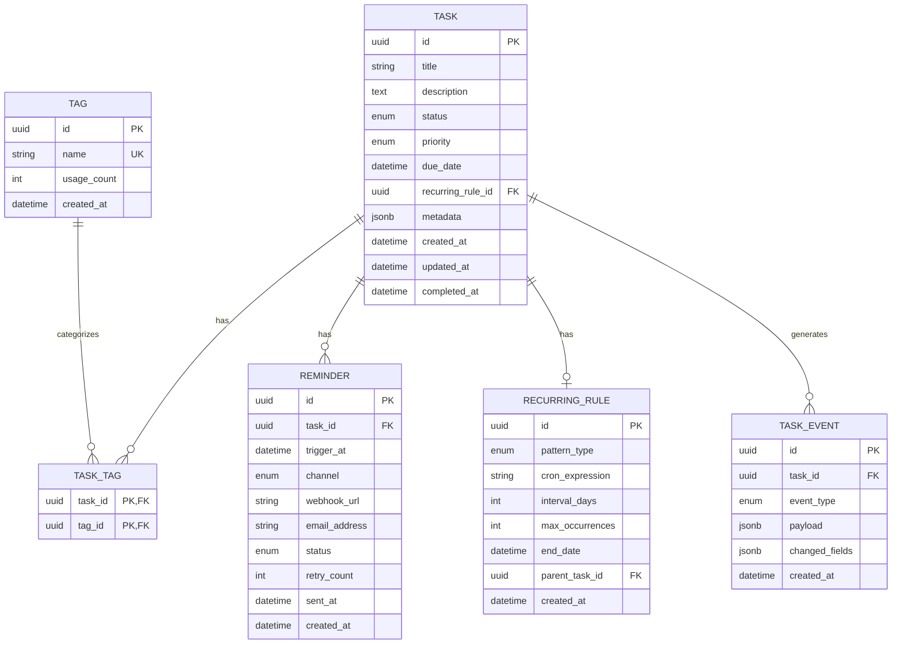

# Data Model: Phase V - Advanced Cloud Deployment

**Feature**: 005-dapr-kafka-cloud-deployment
**Date**: 2026-02-08

---

## Entity Relationship Diagram



---

## Entities

### Task

The central entity representing a todo item.

| Field | Type | Required | Default | Description |
|-------|------|----------|---------|-------------|
| id | UUID | Yes | Auto | Primary key |
| title | VARCHAR(255) | Yes | - | Task title |
| description | TEXT | No | NULL | Detailed description |
| status | ENUM | Yes | 'pending' | pending, in_progress, completed, cancelled |
| priority | ENUM | Yes | 'medium' | high, medium, low |
| due_date | TIMESTAMP | No | NULL | Due date with optional time |
| recurring_rule_id | UUID | No | NULL | FK to RecurringRule if task repeats |
| metadata | JSONB | No | {} | Flexible storage for extra fields |
| created_at | TIMESTAMP | Yes | NOW() | Creation timestamp |
| updated_at | TIMESTAMP | Yes | NOW() | Last update timestamp |
| completed_at | TIMESTAMP | No | NULL | When task was completed |

**Indexes**:
- `idx_task_status`: For filtering by status
- `idx_task_priority`: For sorting by priority
- `idx_task_due_date`: For sorting/filtering by due date
- `idx_task_created_at`: For chronological sorting
- `idx_task_recurring`: For finding recurring tasks efficiently

---

### Tag

Normalized tags for task categorization.

| Field | Type | Required | Default | Description |
|-------|------|----------|---------|-------------|
| id | UUID | Yes | Auto | Primary key |
| name | VARCHAR(50) | Yes | - | Normalized tag name (lowercase, trimmed) |
| usage_count | INT | Yes | 0 | Denormalized count of tasks using this tag |
| created_at | TIMESTAMP | Yes | NOW() | Creation timestamp |

**Constraints**:
- Unique constraint on `name`
- Check: `name` must match `^[a-z0-9_-]+$` (alphanumeric, hyphens, underscores)

**Indexes**:
- `idx_tag_name`: Unique index for fast lookup

---

### TaskTag

Junction table for many-to-many relationship between Tasks and Tags.

| Field | Type | Required | Description |
|-------|------|----------|-------------|
| task_id | UUID | Yes | FK to Task |
| tag_id | UUID | Yes | FK to Tag |

**Constraints**:
- Composite primary key (task_id, tag_id)
- Foreign key cascades: DELETE on Task, RESTRICT on Tag (prevent deleting used tags)

---

### RecurringRule

Defines how a task repeats over time.

| Field | Type | Required | Default | Description |
|-------|------|----------|---------|-------------|
| id | UUID | Yes | Auto | Primary key |
| pattern_type | ENUM | Yes | - | daily, weekly, monthly, custom |
| cron_expression | VARCHAR(100) | No | NULL | For custom patterns (e.g., "0 9 * * 1-5") |
| interval_days | INT | No | NULL | Days between occurrences for simple interval |
| max_occurrences | INT | No | NULL | Stop after N occurrences |
| end_date | TIMESTAMP | No | NULL | Stop after this date |
| parent_task_id | UUID | No | NULL | Reference to original task that created this rule |
| created_at | TIMESTAMP | Yes | NOW() | Creation timestamp |

**Validation Rules**:
- Either `cron_expression` OR `interval_days` must be set (not both)
- At least one end condition: `max_occurrences` OR `end_date` recommended
- `cron_expression` must be valid cron syntax

---

### Reminder

Scheduled notification for a task.

| Field | Type | Required | Default | Description |
|-------|------|----------|---------|-------------|
| id | UUID | Yes | Auto | Primary key |
| task_id | UUID | Yes | - | FK to Task |
| trigger_at | TIMESTAMP | Yes | - | When to send the reminder |
| channel | ENUM | Yes | 'in_app' | in_app, webhook, email |
| webhook_url | VARCHAR(500) | No | NULL | URL for webhook notifications |
| email_address | VARCHAR(255) | No | NULL | Email for email notifications |
| status | ENUM | Yes | 'pending' | pending, sent, failed, cancelled |
| retry_count | INT | Yes | 0 | Number of delivery attempts |
| sent_at | TIMESTAMP | No | NULL | When reminder was delivered |
| created_at | TIMESTAMP | Yes | NOW() | Creation timestamp |

**Indexes**:
- `idx_reminder_trigger`: For efficient reminder scanning (trigger_at, status)
- `idx_reminder_task`: For finding reminders by task

---

### TaskEvent

Domain events for audit trail and event-driven workflows.

| Field | Type | Required | Default | Description |
|-------|------|----------|---------|-------------|
| id | UUID | Yes | Auto | Primary key |
| task_id | UUID | Yes | - | FK to Task |
| event_type | ENUM | Yes | - | created, updated, completed, deleted, reminder_triggered |
| payload | JSONB | Yes | {} | Full task snapshot at event time |
| changed_fields | JSONB | No | NULL | Before/after values for updates |
| created_at | TIMESTAMP | Yes | NOW() | Event timestamp |

**Indexes**:
- `idx_event_task`: For finding events by task
- `idx_event_type`: For filtering by event type
- `idx_event_created`: For time-range queries

---

## State Transitions

### Task Status Flow

```
pending → in_progress → completed
   ↓         ↓
cancelled  cancelled
```

**Rules**:
- A completed task can be reopened (→ pending)
- Cancelled tasks can be reopened
- Recurring tasks auto-create next instance on completion

### Reminder Status Flow

```
pending → sent
   ↓
failed (→ retry → sent OR max retries reached)
   ↓
cancelled (manual or task deleted)
```

---

## Validation Rules

### Task
- Title: 1-255 characters, not empty/whitespace only
- Priority: Must be one of [high, medium, low]
- Due date: If provided, must be in future (except for recurring tasks)

### Tag
- Name: 1-50 characters
- Normalized: lowercase, trimmed
- Allowed chars: alphanumeric, hyphens, underscores
- Unique across all tags

### RecurringRule
- At least one recurrence pattern (cron or interval)
- Max occurrences: positive integer if provided
- End date: if provided, must be in future

### Reminder
- Trigger time: must be in future when created
- Channel validation: webhook_url required if channel=webhook, email required if channel=email
- Max 5 reminders per task to prevent spam

---

## Dapr State Store Mapping

Since Dapr abstracts the database, state is accessed via keys:

| Entity | Dapr State Key | TTL |
|--------|----------------|-----|
| Task | `task�<task_id>` | None |
| Tag | `tag�<tag_id>` | None |
| TaskTag | `tasktag�<task_id>�<tag_id>` | None |
| RecurringRule | `rule�<rule_id>` | None |
| Reminder | `reminder�<reminder_id>` | 90 days after sent |
| TaskEvent | `event�<event_id>` | 30 days (configurable) |

**ETags**: Used for optimistic concurrency control on task updates.

---

## Query Patterns

### Search/Filter (for Dapr State Queries)

1. **List by status**: Query with `statestore/query` using status filter
2. **List by priority**: Sort query by priority field
3. **List by tag**: Query TaskTag junction for tag_id, then fetch tasks
4. **Search text**: Full-text search on title/description via PostgreSQL
5. **Due date range**: Query with due_date between range
6. **Combined**: All filters can be combined with AND logic

### Kafka Topic Events

Events are published to topics for reactive workflows:

| Event | Topic | Payload |
|-------|-------|---------|
| Task Created | task-events | {type: 'created', task: {...}} |
| Task Updated | task-events | {type: 'updated', task: {...}, changes: {...}} |
| Task Completed | task-events | {type: 'completed', task: {...}} |
| Task Deleted | task-events | {type: 'deleted', task_id: '...'} |
| Reminder Triggered | reminders | {reminder_id: '...', task_id: '...'} |
| Real-time Update | task-updates | {type: '...', data: {...}} |

