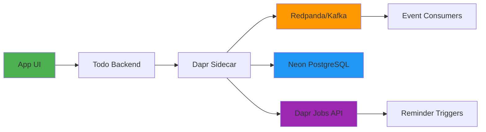

# Implementation Plan: Phase V - Advanced Cloud Deployment of Todo Chatbot

**Branch**: `005-dapr-kafka-cloud-deployment` | **Date**: 2026-02-08 | **Spec**: [005-dapr-kafka-cloud-deployment/spec.md]
**Input**: Feature specification from `/specs/005-dapr-kafka-cloud-deployment/spec.md`

**Note**: This template is filled in by the `/sp.plan` command. See `.specify/templates/commands/plan.md` for the execution workflow.

## Summary

Implementation of an event-driven todo application using Dapr, Redpanda/Kafka, and Kubernetes for cloud deployment. The system includes advanced features like task priorities, tagging, recurring tasks, and reminders with Dapr pub/sub, state management, and job scheduling components. Local deployment on Minikube and production deployment on DigitalOcean Kubernetes Service (DOKS) with CI/CD via GitHub Actions.

## Technical Context

**Language/Version**: Python 3.13, FastAPI 0.115, Dapr SDK Python
**Primary Dependencies**: Dapr 1.14.0, Redpanda Kafka API, Neon PostgreSQL, FastAPI, SQLModel, Kubernetes 1.29
**Storage**: Neon PostgreSQL (serverless), Redpanda Kafka (messaging), Dapr State Store (abstraction layer)
**Testing**: pytest with integration tests for Dapr components, event flow testing
**Target Platform**: Linux K8s cluster (Minikube for local, DOKS for production), containerized application
**Project Type**: Web application with microservices architecture via Dapr sidecars
**Performance Goals**: Sub-second task operations, 95% of recurring tasks generate within 1 min of completion, 99% reminder delivery reliability within 30 seconds
**Constraints**: Must run on free tier resources (Neon free tier, Redpanda Cloud free tier, DigitalOcean credits), <100 concurrent users initially, event-driven architecture for scalability
**Scale/Scope**: Single tenant deployment supporting 1000+ tasks per user, 100 task operations/second, 10k+ users when scaled

## Constitution Check

*GATE: Must pass before Phase 0 research. Re-check after Phase 1 design.*

Based on constitution principles:
- ✅ Spec-Driven and AI-Native: Following Spec-Kit Plus integration with spec, plan, and tasks approach
- ✅ Efficient and Scalable: Using free tiers (Neon, Redpanda Cloud free tier) and optimizing for GitHub Actions CI/CD
- ✅ Structured and Comprehensive: Outputting monorepo with proper K8s manifests and Helm charts
- ✅ Helpful and Innovative: Progressive evolution from console to distributed AI system with Dapr and event-driven features
- ✅ Honest and Accurate: Using exact phase requirements without inventing unsupported technologies
- ✅ Practical yet Advanced: Incorporating Dapr, Kafka, and cloud-native blueprints for advanced deployment

## Project Structure

### Documentation (this feature)

```text
specs/005-dapr-kafka-cloud-deployment/
├── plan.md              # This file (/sp.plan command output)
├── research.md          # Phase 0 output (/sp.plan command)
├── data-model.md        # Phase 1 output (/sp.plan command)
├── quickstart.md        # Phase 1 output (/sp.plan command)
├── contracts/           # Phase 1 output (/sp.plan command)
│   └── api.yaml         # OpenAPI contract
└── tasks.md             # Phase 2 output (/sp.tasks command - NOT created by /sp.plan)
```

### Source Code Structure

```text
phase2/
├── docker/
│   └── Dockerfile       # Backend application Dockerfile
├── k8s/
│   └── cloud/
│       ├── dapr-components/    # Dapr component definitions (pubsub, state, bindings)
│       │   ├── pubsub-kafka.yaml
│       │   ├── state-postgres.yaml
│       │   ├── binding-cron.yaml
│       │   └── secretstore-kubernetes.yaml
│       ├── helm/               # Helm chart for application deployment
│       │   ├── Chart.yaml
│       │   ├── values.yaml
│       │   └── templates/
│       │       ├── deployment.yaml
│       │       ├── service.yaml
│       │       ├── hpa.yaml
│       │       └── _helpers.tpl
│       └── manifests/          # Raw K8s manifests for alternative deployments
│           ├── deployment.yaml
│           ├── service.yaml
│           └── ingress.yaml
└── github-workflows/
    └── deploy-doks.yml       # GitHub Actions workflow for DOKS deployment

backend/
├── src/
│   ├── main.py              # FastAPI application entry point
│   ├── models/              # Pydantic models for API
│   ├── services/            # Business logic and event handling
│   │   ├── task_service.py
│   │   ├── recurring_service.py
│   │   ├── reminder_service.py
│   │   └── event_service.py
│   ├── dapr/                # Dapr integration code
│   │   ├── client.py        # Dapr client utilities
│   │   ├── pubsub.py        # Pub/sub handlers
│   │   └── bindings.py      # Input/output bindings
│   └── api/
│       ├── routes/
│       │   ├── tasks.py
│       │   ├── reminders.py
│       │   └── recurring.py
│       └── deps.py          # Dependency injection
├── tests/
│   ├── unit/
│   ├── integration/         # Tests involving Dapr components
│   └── contract/            # Contract tests against OpenAPI spec
└── requirements.txt

frontend/                    # Next.js 16+ chatbot UI (extended from Phase III)
├── src/
│   ├── components/
│   ├── pages/
│   └── services/
└── package.json
```

### Event Flow Architecture



**Structure Decision**: Web application with microservices architecture via Dapr sidecars, separating concerns into backend services with Dapr managing pub/sub, state, and job scheduling. Frontend remains separate but extends to support new features like reminders and recurring tasks.

## Complexity Tracking

> **Fill ONLY if Constitution Check has violations that must be justified**

| Violation | Why Needed | Simpler Alternative Rejected Because |
|-----------|------------|-------------------------------------|
| Dapr + Kafka + PostgreSQL | Event-driven architecture with state management needed for reminders and recurring tasks | Direct API calls would lack reliability and scalability |
| Kubernetes deployment | Production-grade deployment with scaling and resilience | Serverless alternatives insufficient for complex event flows |
