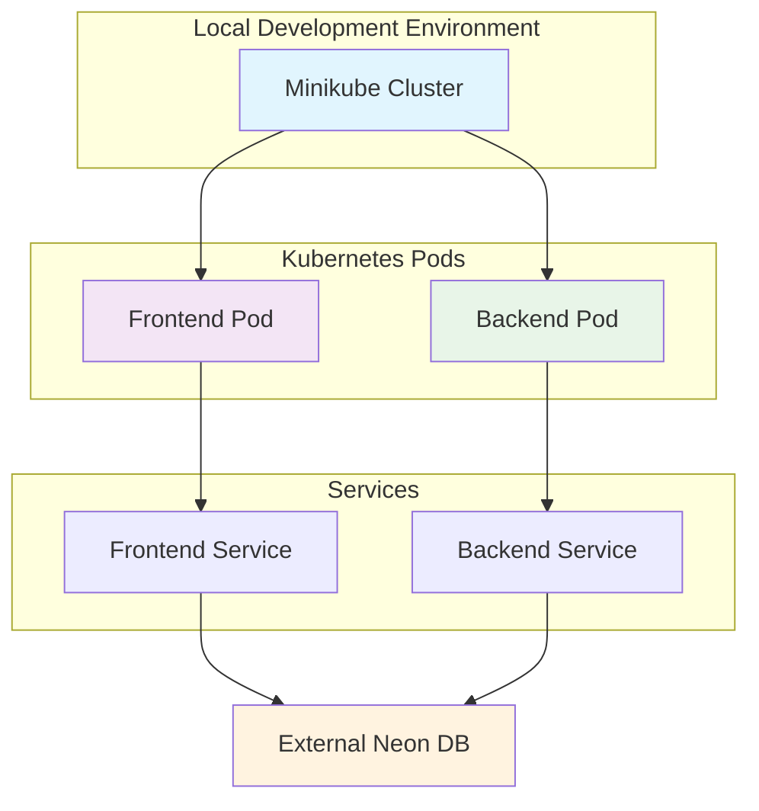

# Implementation Plan: Local Kubernetes Deployment of Todo Chatbot

**Branch**: `1-k8s-todo-chatbot-deploy` | **Date**: 2026-02-04 | **Spec**: [specs/1-k8s-todo-chatbot-deploy/spec.md](../specs/1-k8s-todo-chatbot-deploy/spec.md)

**Note**: This template is filled in by the `/sp.plan` command. See `.specify/templates/commands/plan.md` for the execution workflow.

## Summary

Containerize the Todo Chatbot frontend (Next.js) and backend (FastAPI + MCP + Agents SDK) applications and deploy them on a local Minikube cluster using AI-assisted tools (Gordon AI, kubectl-ai, kagent). The deployment will connect to an external Neon database and use spec-driven blueprints for Helm chart generation.

## Technical Context

**Language/Version**: Dockerfile, Helm Chart YAML, Kubernetes manifests
**Primary Dependencies**: Docker Desktop, Minikube, Helm, kubectl, Gordon AI, kubectl-ai, kagent
**Storage**: External Neon database connection via ConfigMap
**Testing**: Kubernetes health checks, service connectivity tests
**Target Platform**: Local Minikube cluster (Kubernetes v1.28+)
**Project Type**: Web application (containerized)
**Performance Goals**: Sub-2 minute deployment time, <30s database connection establishment
**Constraints**: No manual YAML coding - all via AI tools, spec-driven approach, optimized container sizes
**Scale/Scope**: Single-cluster deployment with ability to scale to 3 replicas

## Constitution Check

*GATE: Must pass before Phase 0 research. Re-check after Phase 1 design.*

Based on constitution principles:
- ✓ Spec-Driven and AI-Native: Using Spec-Kit Plus workflow with AI tools (Gordon, kubectl-ai)
- ✓ Structured and Comprehensive: Following monorepo blueprint with proper k8s/ directory structure
- ✓ Efficient and Scalable: Using containerization and Kubernetes for scalability
- ✓ Practical yet Advanced: Integrating AI-native deployment tools and Helm charts

## Project Structure

### Documentation (this feature)

```text
specs/1-k8s-todo-chatbot-deploy/
├── plan.md              # This file (/sp.plan command output)
├── research.md          # Phase 0 output (/sp.plan command)
├── data-model.md        # Phase 1 output (/sp.plan command)
├── quickstart.md        # Phase 1 output (/sp.plan command)
├── contracts/           # Phase 1 output (/sp.plan command)
└── tasks.md             # Phase 2 output (/sp.tasks command - NOT created by /sp.plan)
```

### Source Code (repository root)

```text
k8s/
├── docker/
│   ├── frontend/
│   │   └── Dockerfile        # Generated by Gordon AI for Next.js frontend
│   └── backend/
│       └── Dockerfile        # Generated by Gordon AI for FastAPI backend
├── helm/
│   └── todo-chatbot/         # Helm chart generated by kubectl-ai/kagent
│       ├── Chart.yaml
│       ├── values.yaml
│       └── templates/
│           ├── deployment-frontend.yaml
│           ├── deployment-backend.yaml
│           ├── service-frontend.yaml
│           ├── service-backend.yaml
│           ├── configmap.yaml
│           └── ingress.yaml
└── manifests/               # Alternative K8s manifests if needed
    ├── namespace.yaml
    ├── frontend-deployment.yaml
    ├── backend-deployment.yaml
    ├── frontend-service.yaml
    ├── backend-service.yaml
    └── configmap-db.yaml
```

**Structure Decision**: Web application with containerized frontend and backend services deployed via Helm charts to local Minikube cluster, with external Neon database connection managed via ConfigMap.

## Complexity Tracking

> **Fill ONLY if Constitution Check has violations that must be justified**

| Violation | Why Needed | Simpler Alternative Rejected Because |
|-----------|------------|-------------------------------------|
| Multiple deployment tools | Need both Docker and K8s expertise | Single tool approach insufficient for container orchestration requirements |

## Architecture Diagram



## Phase 0: Research & Analysis

### Containerization Research
- Dockerfile generation for Next.js frontend using Gordon AI
- Dockerfile generation for FastAPI backend with MCP/Agents SDK
- Container optimization techniques and security best practices
- Multi-stage builds for optimized image sizes

### Kubernetes Deployment Research
- Helm chart generation patterns using kubectl-ai and kagent
- Best practices for ConfigMap and Secret management
- Service discovery between frontend and backend in K8s
- Health checks and readiness/liveness probes

### AI Tool Integration Research
- Gordon AI Dockerfile generation commands and capabilities
- kubectl-ai Helm chart generation commands
- kagent for deployment operations
- Blueprint generation from specifications

## Phase 1: Design & Contracts

### Container Design
- Frontend container: Next.js app with optimized build
- Backend container: FastAPI with MCP tools and Agents SDK
- Multi-stage builds to minimize attack surface
- Security scanning integration

### Helm Chart Design
- Parameterized values for different environments
- Proper resource limits and requests
- Service definitions with appropriate ports
- ConfigMap for database connection details
- Ingress configuration for external access

### Deployment Configuration
- Namespace isolation for the application
- Replica sets for scalability
- Resource quotas and limits
- Network policies (if required)
- Monitoring and logging configuration

## Phase 2: Implementation Approach

### Containerization Phase
1. Generate Dockerfiles using Gordon AI for both frontend and backend
2. Build and test container images locally
3. Push images to local registry or use imagePullPolicy: Never

### Helm Chart Generation
1. Generate Helm chart structure using kubectl-ai
2. Customize templates for our specific application needs
3. Configure database connection via ConfigMap
4. Test chart installation and upgrades

### Deployment & Operations
1. Start Minikube cluster
2. Install Helm chart
3. Verify service connectivity and functionality
4. Test scaling capabilities
5. Validate database connection

## Blueprint Skill Definition

### HelmGeneratorSkill
A Claude Code Agent Skill that generates Helm YAML from specifications:
- Input: Feature specification and requirements
- Output: Complete Helm chart with all necessary resources
- Capabilities: Generate deployments, services, configmaps, ingresses
- Validation: Ensures generated YAML follows best practices and security standards