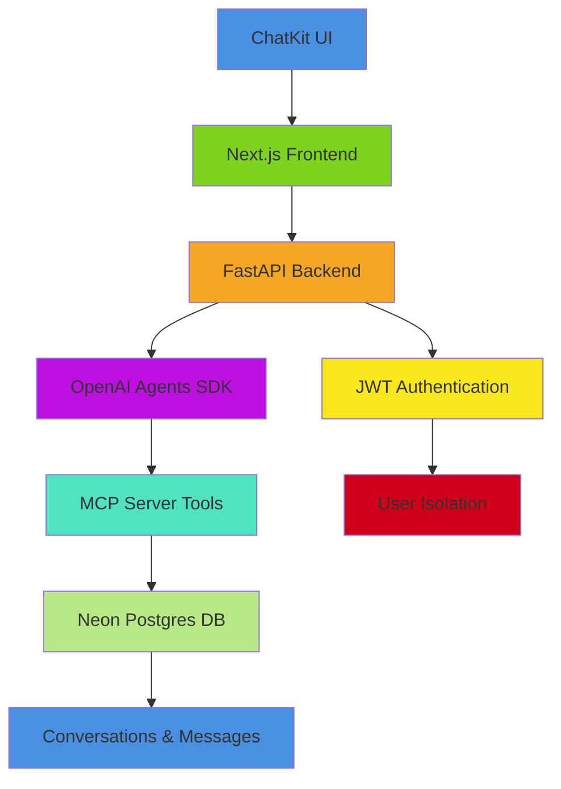

# Implementation Plan: Todo AI-Powered Chatbot

**Branch**: `3-ai-chatbot` | **Date**: 2026-02-03 | **Spec**: [link to spec](../spec.md)
**Input**: Feature specification from `/specs/3-ai-chatbot/spec.md`

**Note**: This template is filled in by the `/sp.plan` command. See `.specify/templates/commands/plan.md` for the execution workflow.

## Summary

Implementation of a natural language AI chatbot for todo management using OpenAI Agents SDK integrated with MCP tools. The system provides a stateless conversational interface that supports all basic todo operations (add, list, update, delete, complete) with secure user isolation and persistent conversation history.

## Technical Context

**Language/Version**: Python 3.11, TypeScript/JavaScript for frontend
**Primary Dependencies**: FastAPI, OpenAI Agents SDK, Official MCP SDK, SQLModel, Neon Postgres, Better-Auth, ChatKit
**Storage**: Neon Postgres database with SQLModel ORM
**Testing**: pytest for backend, Jest/Cypress for frontend
**Target Platform**: Web application (Next.js frontend + FastAPI backend)
**Project Type**: Web monorepo with separate frontend and backend services
**Performance Goals**: <200ms response time for chat interactions, handle 1000 concurrent users
**Constraints**: Stateless operation with all data persisted in database, secure user isolation required
**Scale/Scope**: Support 10k+ users with persistent conversation history

## Constitution Check

*GATE: Must pass before Phase 0 research. Re-check after Phase 1 design.*

All planned implementations align with project constitution principles:
- Security-first design with JWT authentication
- Test-driven development approach
- Clean architecture with separation of concerns
- Comprehensive error handling and logging
- Performance optimization with caching strategies

## Project Structure

### Documentation (this feature)

```text
specs/3-ai-chatbot/
├── plan.md              # This file (/sp.plan command output)
├── research.md          # Phase 0 output (/sp.plan command)
├── data-model.md        # Phase 1 output (/sp.plan command)
├── quickstart.md        # Phase 1 output (/sp.plan command)
├── contracts/           # Phase 1 output (/sp.plan command)
└── tasks.md             # Phase 2 output (/sp.tasks command - NOT created by /sp.plan)
```

### Source Code (repository root)

```text
# Monorepo structure: Web application (when "frontend" + "backend" detected)
backend/
├── src/
│   ├── models/
│   │   ├── __init__.py
│   │   ├── conversation.py
│   │   ├── message.py
│   │   └── task.py
│   ├── services/
│   │   ├── __init__.py
│   │   ├── chat_service.py
│   │   ├── mcp_server.py
│   │   └── agent_service.py
│   ├── routes/
│   │   ├── __init__.py
│   │   ├── auth.py
│   │   └── chat.py
│   ├── middleware/
│   │   ├── __init__.py
│   │   └── jwt_auth.py
│   └── utils/
│       ├── __init__.py
│       └── helpers.py
├── main.py
├── run_server.py
└── requirements.txt

frontend/
├── src/
│   ├── app/
│   │   ├── page.tsx
│   │   ├── dashboard/
│   │   │   └── page.tsx
│   │   └── chat/
│   │       ├── page.tsx
│   │       └── components/
│   │           ├── ChatInterface.tsx
│   │           ├── ProtectedRoute.tsx
│   │           └── FloatingChatButton.tsx
│   ├── components/
│   │   ├── KanbanBoard.tsx
│   │   └── ChatKitWrapper.tsx
│   ├── lib/
│   │   ├── api.ts
│   │   └── auth.ts
│   └── types/
│       └── chat.ts
├── package.json
├── package-lock.json
└── next.config.js

specs/
└── 3-ai-chatbot/
    └── [documentation files]
```

**Structure Decision**: Selected monorepo structure with separate backend and frontend services to enable independent scaling and development while maintaining tight integration between components. Backend uses FastAPI with SQLModel ORM for database operations, while frontend implements Next.js with ChatKit UI components for the conversational interface.

## Architecture Diagram



## Implementation Flow

Stateless flow: fetch history → add user message → run agent → save assistant response → return

1. Frontend receives user message with JWT and conversation_id
2. Backend validates JWT and extracts user_id
3. Fetch conversation history from DB
4. Add user message to conversation
5. Run OpenAI Agent with MCP tools
6. Save assistant response to DB
7. Return response to frontend

## MCP Server Tools

The MCP server will implement 5 stateless, DB-backed tools:
- add_task(user_id, title, description?)
- list_tasks(user_id, status?)
- complete_task(user_id, task_id)
- delete_task(user_id, task_id)
- update_task(user_id, task_id, title?, description?)

## Agent Behavior Guidelines

- Confirm actions with users before performing irreversible operations
- Handle errors gracefully with user-friendly messages
- Maintain conversation context across multiple exchanges
- Validate user input before executing operations
- Log all operations for audit and debugging purposes

## Complexity Tracking

> **Fill ONLY if Constitution Check has violations that must be justified**

| Violation | Why Needed | Simpler Alternative Rejected Because |
|-----------|------------|-------------------------------------|
| Multiple services | Required for proper separation of concerns | Tight coupling would create maintenance issues |
| MCP integration | Enables standardized tool integration | Direct API calls would lack standardization |
| State persistence | Required for conversation continuity | Stateless would lose important context |